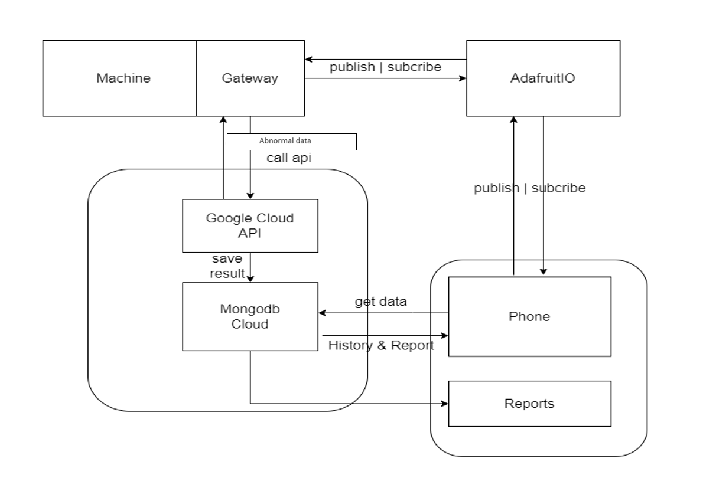

# surface_inspection_using_robot

## Overview
This is my project about robot detect fault surface (For easy visualization, please watch the demo video below )

## Project Goals
    - APP: The application is programmed in Java and has functions such as viewing the history 
    of surface defects, controlling iot devices, statistics of surface defects, taking pictures
    and diagnostic images.

    
    - Machine learning: The machine learning part solves two main tasks of detecting surface defects;
    abnormal data detection and fault area segmentation. In detecting surface defects part, i used 
    pretrained-model VGG16, InceptionV3, Resnet50 combined with CNN classifer. In abnormal data detection
    and fault area segmentation, I used two methods: semi-supervised learning and supervised learning. 
    Supervised learning used gabor filter method to detect abnormal data and  UnetVGG16, UnetResnet served
    for segmentation. Semi-supervised learning used the method of recovering data intact with the model is 
    ResnetCAE and then find the anomaly detection threshold.
    
    
    - Api: api is programmed in python language and uploaded to google cloud. 
    Diagnostic history data saved to Mongodb database.  

    
    
    - Gateway: gateway is programmed in python allowing connection to device and iot server (Adafruit.io)  

## Skills:
- Machine learing: Type detection, anomaly segmentation **(VGG16, InceptionV3, Resnet50, UnetVGG16, UnetResnet)**
- APP: java code
- Gateway: Python code
- server: **Adafruit, api google cloud, mongodb cloud**

## Architecture Diagram

## VIDEO DEMO:
[Robot Demo](https://drive.google.com/file/d/1ECRe7Chom5nmzTFUQLVTk-bYeOn25ufL/view?fbclid=IwAR2KAvDHnICtF8WUmtq9JPnaUBbSuJt8P9VtsFLdnxtEuGtJfUAX_MRZ4qU)  

[machine learning demo](https://drive.google.com/file/d/1xHsPtSe-SR2vd8JMXqIQzKAyNU4O8YEo/view?usp=sharing)  
[App demo part1](https://drive.google.com/file/d/1ht0nrp8S0C03m8fB0qoxKBsNJjI1zblz/view?usp=sharing)  
[App demo part2](https://drive.google.com/file/d/1q8-6nw2_a3XFLuBZorohhxvS0G4NeGmu/view?usp=sharing)  

